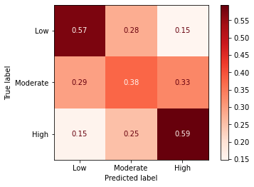

# How the New York Times can increase Facebook engagement

## Using machine learning to understand characteristics of high engagement
***
**Author**: Jessica Miles - jess.c.miles@gmail.com

***

This analysis uses machine learning to understand the characteristics of New York Times Facebook posts that predict higher engagement.

Although my model was not accurate enough to recommend using for prediction of future articles, it was able to determine important keyword and topical themes among high engagement posts. Interpreting these themes will help The New York Times prioritize the type of content to post to Facebook to increase engagement. 

## Business Problem

Modern Americans consume news in multiple formats: printed newspaper, online on websites, and on social media. To remain relevant in modern times, news outlets need to be able to engage users on platforms such as Facebook as well as using traditional methods. However, what Facebook users engage with more may differ from consumers of print media.

One criterion Facebook's News Feed algorithm uses to prioritize what its users see is amount of engagement (shares, comments, and likes) on a given post. Higher prioritization in News Feed may help content be disseminated to a wider audience, some of whom may decide to become subscribers.

Relevant and important news is not always the most popular, so outlets like The New York Times will likely not want to simply use top predictors of engagement on Facebook to decide what to report on. However, understanding what people engage with the most will shed light on what Facebook users care about, and may help The Times decide which articles to prioritize for posting. I also modeled how and when posts were made, to shed insights on steps The Times could take to increase engagement on any topic.

## Data
I started with a [found dataset](https://data.world/martinchek/2012-2016-facebook-posts) of about 48,000 Facebook posts from the New York Times' account covering the time period from late 2012 to late 2016. Data included the text in the post, when it was posted, and post type (link, video, or photo).

I also used the NYT API to pull all article metadata from this time period, and went through several steps to match the content in the Facebook posts to articles of mutimedia features. The NYT API provided additional metadata about the news content, such as topical subjects, article word count, and format (written versus multimedia).

Of the original 48,000, I was only able to match about 43,000 because of various differences between post text and links and the current text and links I could pull from the API. Therefore, I modeled all posts versus matched posts as two separate data sets.

## Methods

Engagement metrics included number of comments, shares, and likes/loves. Rather than focus on just one, I created a binary target representing "high engagement".
- Calculated the percentile for each separate metric
- Calculated the mean of percentiles across metrics
- Used mean percentile of 75 as the cutoff: posts with mean percentile over 75th were considered "high engagement" and those under 75th were "average engagement".
- I also engineered a multi-class target using the same criteria for "high", but splitting the rest into "average" (below 25th percentile) and "moderate" (25th to 50th percentile).

Below are the distributions for each engagement metric. Note: Histograms don't include outliers for visibility, but percentiles are calculated using all posts.

### Comments Distribution (All Posts)


### Shares Distribution (All Posts)


### Likes Distribution (All Posts)


The distributions of all pots and matched posts were quite similar. Although I modeled them separately, I used results form both sets of models in my final conclusions, without differentiating.

There appeared to be a slight uptick in engagement when posts were made on weekends, so I engineered a categorica variable for that.

I also engineered a categorical variable for time of day the post was made, as posts made in the morning and evening appeared to get more engagement.

When I visualized the most frequent words for high versus average engagement, I saw that words related to 2016 presidential candidates were more common in high engagement than in average. Otherwise though, they looked quite similar.

### Word Frequencies for Average Engagement


### Word Frequencies for High Engagement


I also noticed that some high engagement posts posed questions to users, and asked their opinions. I created custom stopwords lists without permutations of the word "you" and without the quotation mark, to test performance compared to full stop words and punctuation list.

## Model Performance

I modeled both a binary and multi-class problem. 

The binary performed slightly better on High Engagement, but the multi-class was interesting to understand how the model tended to get confused.

The best binary classificatino model was able to identify about 61% of high engagement posts correctly using cross-validation.


Distributions of all three engagement metrics had lots of outliers on the high end and tapered off very smoothly. I chose the 75th percentils as the cutoff for high, but there really is no obvious cutoff point. I think it's natural that the model would be confused about posts in the middle. The multi-class model confirms this, as it performed most poorly on the Moderate Engagement middle class.



## Model Results

### Top Keywords for High Engagement


<p float="left">
    
    
</p>
<p float="left">
    
    
</p>

### Top Metadata Properties of High Engagement Posts


### Top Subjects for High Engagement


<p float="left">
    
    
    
</p>

### Top Keyword Predictors of Average Engagement


<p float="left">
    
    
</p>
<p float="left">
    
    
</p>
<p float="left">
    
    
</p>

### Top News Sections for Average Engagement


### Top Subjects for Average Engagement


- General political and sports subjects, as seen before
- Events outside the US (agrees with the World news section above)

## Recommendations:

### For High Engagement

Prioritize posts related to:
- "Breaking News"
- Opinion pieces
- Recipes
- Obituaries
- President-related names (Obama, and candidates in the 2016 presidential election race)
- Divisive and controversial topics (gun control, gender equality, racial equality, vaccination, Muslim veiling, aminal rights and abuse)

Although diverse, don't neglect "light" topics such as cats, hair, happiness, walking, kids, as these can also be quite successful.

Post content as photo or video versus as a link. Even if the content is multimedia, it only gets more engagement if posted as an uploaded photo or video.

As appropriate, post in the evening (7 PM to 11 PM) versus at other times of day. Also post on the weekends as appropriate.

De-prioritize posts related to:

- General sports
- General political content
- Recurring pieces such as "Quotation of the Day", "Daily Briefing", "New York Today"

I wasn't able to determine a clear pattern, but also avoid posting text containing:
- "Here's what you need to know"
- "week"
- the quotation mark


## Caveats and Limitations

- Facebook's own News Feed algorithm is very important to driving engagement, and is based partly on user-centric preferences which we can't model
- Odds of top predictors varied slightly depending on data split used for training
- Leaning in to controversial or divisive topics should be carefully considered
- The cutoff point for "High engagement" is somewhat arbitrary
Tastes change, so results from 2016 may not be applicable to present day. Facebook's algorithm also may have changed.

## Potential Next Steps

- Review sentiment of articles to see whether that affects engagement
- Compare engagement on Facebook to comments count on the New York Times website, so see if there is a difference in what drives engagement there
- Create an interactive dashboard so engagement of certain words and subjects can be reviewed

### For further information
Please review the narrative of my analysis in [my jupyter notebook](./index.ipynb) or review my [presentation](./presentaion.pdf)

For any additional questions, please contact **jess.c.miles@gmail.com


##### Repository Structure:

Here is where you would describe the structure of your repoistory and its contents, for exampe:

```

├── README.md               <- The top-level README for reviewers of this project.
├── index.ipynb             <- narrative documentation of analysis in jupyter notebook
├── data_gathering.ipynb             <- notebook used to gather data from NYT API and match it to posts
├── presentation.pdf        <- pdf version of project presentation
└── images
    └── images              <- images of visualizations
└── data
    └── data                <- found and generated during analysis
└── models
    └── models              <- exported copies of best model pipelines

```
