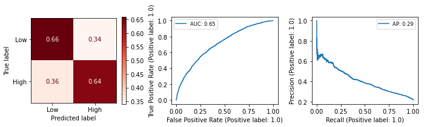
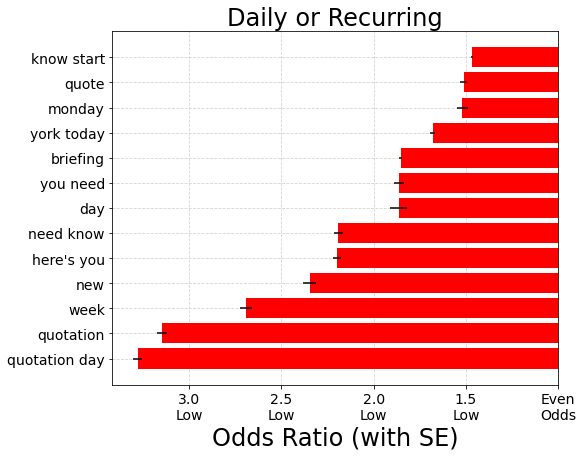
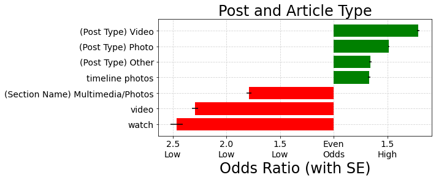

# How The New York Times can increase Engagement on Facebook

## Using machine learning to understand characteristics of news content that garners "high" Facebook engagement
***
**Author**: Jessica Miles - jess.c.miles@gmail.com

***


In this repository, I used machine learning to understand the characteristics of Facebook content posted by The New York Times that lead to high user engagement. The analysis includes Natural Language Processing (NLP) of the post and article metadata as well as categorical features from both the posts and original articles.

My model was ultimately not accurate enough for me to recommend using it as a "black box" deciding which articles to post to Facebook. Instead, I used its coefficients to determine the most important keyword and topics among high versus low engagement posts, then grouped together similar topics and keywords together into themes to form recommendations. I believe this approach resulted in  generalized results which are more likely to be useful over time, as compared to focusing on specific high engagement topics which only occur once, such as "the 2016 Presidential Election."

## Business Problem

Modern Americans consume news in multiple formats: in print, browsing and searching websites online, and on social media. To remain relevant in modern times, news organizations need to be able to engage users on social media platforms such as Facebook as well as using traditional print and web methods. 

However, news outlets may produce far more content than can reasonably be posted to such platforms, so they need a methodology to decide what content formats and topics will be most successful. The type of content Facebook users engage with most may differ from what is run on the front page of the printed paper, so it's prudent to analyze user engagement with Facebook content as a standalone exercise.

One criterion Facebook's News Feed algorithm uses to prioritize content's visibility to users is the amount of initial engagement (shares, comments, and likes) on a given post. Higher prioritization in News Feed may help content be disseminated to a wider audience, some of whom may decide to become subscribers.

It's important to note that while this analysis focuses on increasing engagement, I do not advocate for engagement level to be the only consideration in deciding what to post. Just because people enjoy sharing recipes and reading pieces about animals doesn't mean The Times should unequivocally prioritize those topics over pieces related to general politics or the economy. However, understanding the patterns behind high Facebook engagement could be included as one factor of many in the ultimate editorial decision.

## Data
I started with a [found dataset](https://data.world/martinchek/2012-2016-facebook-posts) of about 48,000 Facebook posts from The New York Times' account covering the time period from late 2012 to late 2016. Data used in the analysis included the text in the post, when it was posted, and post type (link, video, or photo).

I also used the [NYT API](https://developer.nytimes.com/apis) to pull all article metadata from this time period, and went through several steps to match the content in the Facebook posts to their original articles and multimedia features. The data I retrieved from the NYT API included article headline and abstract as well as metadata such as the news desk the article came from, topical subjects and other entities mentioned in the articles, word count, and format (written versus multimedia).

Of the original 48,000 Facebook posts, I was only able to match about 43,000 of them to articles. There were some challlenges in performing the matching due to differences between FB post text and links and the current article abstract and links; the links in the Facebook posts were often shortened, and even once expanded did not always match directly to a current article. Therefore, I modeled the features derived from all Facebook posts as a separate data set from the features derived from matched articles.

## Methods

Engagement metrics included number of comments, shares, and likes/loves. Rather than focus on each of these separately, I created a single engagement metric.
- First, I calculated the percentile for each separate metric for each post
- Then, I calculated the mean of percentiles across the three metrics to act as a single engagement metric for that post
- For my binary classification problem, posts with mean percentile over 75th were considered "high engagement" and those under 75th were considered "low engagement".
- I also engineered a multi-class target using the same criteria for "high", but splitting the rest into "low" (below 25th percentile) and "moderate" (25th to 50th percentile).

Below are the distributions for each engagement metric. Note: Histograms don't include outliers for visibility, but percentiles are calculated with outliers included.

### Comments Distribution (All Posts)


### Shares Distribution (All Posts)


### Likes Distribution (All Posts)


The distributions of all Facebook posts and the smaller subset of posts matched to articles were quite similar. Although I modeled them separately, I used results from both sets of models in my final recommendations.

There appeared to be a slight uptick in engagement when posts were made on weekends, so I engineered a categorical variable for that.

I also engineered a categorical variable for time of day the post was made, as posts made in the morning and evening appeared to get more engagement.

When I visualized the most frequent words for high versus low engagement, I saw that words related to 2016 presidential candidates were more common in high engagement than in average. Otherwise though, they looked quite similar.

### Word Frequencies for Low Engagement


### Word Frequencies for High Engagement


I also noticed that some high engagement posts posed questions to users, and asked their opinions. I created custom stopwords lists without permutations of the word "you" and without the quotation mark, to test performance compared to full stop words and punctuation list.

I used sklearn's GridSearchCV combined with pipelines and other transformer classes to iterate over several different NLP preprocessing approaches, as well as Logistic Regression and Nauve Bayes model hyperparameters. The preprocessing steps I tested included:
- Text vectorization strategy count, binary, or count + Tf-Idf normalization
- Removing different sets of stopwords and punctuation
- Uni-grams, bi-grams, or both
- Applying lemmatization (with POS tags) or not
- Varying number of `max_features` to be used in modeling

## Model Performance

I modeled both a binary and multi-class problem. 

The binary performed slightly better on High Engagement, but the multi-class was interesting for what it showed about how the model tended to get confused.

The best binary classification model was able to identify about 62% of high engagement posts correctly (score is cross-validated, and on unseen test data).

Preprocessing and model parameters for the best model were as follows:
- Removed NLTK stopwords and punctuation, with the exception of '?' and permutations of the word 'your'
- TF-IDF normalization on word vectors cosisting of both uni-grams and bi-grams
- Maximum 2000 features (both word vectors and topics)
- Logistic Regression model using L2 regularization, no intercept fitted

### Binary Confusion Matrix on Test Data



### Multi-Class Confusion Matrix on Test Data


Distributions of all three engagement metrics were very right-skewed: they had many outliers on the high end and tapered off very smoothly. I ultimately chose the 75th percentile as the cutoff for "high engagement", but there truly was no obvious cutoff point. Earlier in my analysis, I initially onsidered only outliers (using IQR * 1.5) to be high engagement, but these models did not perform as well. I believe it's natural that the model would be confused about posts towards the middle of the distribution regardless of where the cutoff point is drawn. The multi-class model confirms this, as it performed most poorly on the Moderate Engagement middle class which represents the 25th through 75th percentiles.

## Recommendations:

To generate recommendations, I examined the predictors that had greatest odds ratios of High and Low engagement. Because the feature space was highly dimensional, and any given train-test-split may yield different top predictors, I performed 5 fits on different splits of the entire dataset, and generated a mean odds ratio across all 5 fits. I also calculated the confidence interval for this odds ratio based on the standard deviation across the fits, which is represented as black lines on the charts below. I ultimately only considered predictors which were included in at least 2 fits (only the top 2000 were used, so this did vary depending on the train-test-split), and which had odds ratios over 1.0, within the confidence interval.

I reviewed the top predictors of High and Low engagement manually in a Google Sheet, and grouped them logically into similar categories. I reviewed the top 300 predictors of both High and Low for Facebook post uni-grams and bi-grams as well as original article subjects, for a total of about 1,200 words and topics that I categorized.

### 1. Prioritize Breaking News over Recurring Content

- Breaking News was one of the top predictors of high engagement
- In contrast, posts that represented daily or recurring features tended to have lower engagement. Examples include: Quotation of the Day, New York Today, Daily Briefing ("Here's what you need to know to start your day"), What You Should Watch This Week 




### 2. Focus on the Current President and Election over General Politics

- Topics related to the candidates in the 2016 presidential election, and the current president and first lady at the time, were highly engaging.
- However, topics related to general politics and government were less engaging.


### 3. Prioritize U.S. National content over U.S. Local and Foreign

- Posts that mention 'America', 'Americans' and 'American', as well as patriotics themes such as the national anthem and flags, are highly engaging.
- Posts with words that seem more local to certain places are less engaging, as is most foreign coverage.


### 4. Post More Multimedia Content Outside Subscriber Paywall

- Video and Photo post types are where photos and videos were uploaded to Facebook, so are outside the paywall. These are more engaging.
- Most posts containing the words "video" or "watch" are actually posted as links to content, which is frequently behind the paywall. These are less engaging.




### 5. Post on Evenings and Weekends, when appropriate

- Content posted from 7 PM to 11 PM or on a weekend day has slightly increased odds of high engagement compared to posts added at other times
- This is likely due to News Feed algorithm prioritizing recently posted content, and these being popular times to engage with Facebook


### 6. Focus on Additional Highly Engaging Topics
- Opinion and Editorial content (though not Op-Eds and Ethics)
- Obituaries
- Recipes and Cooking (though not Food section)
- Parenting and Children
- Mental Health
- Beauty and Self Care
- Exercise
- Marriage and Relationships
- Religion

See the Appendix in [my presentation](./presentation.pdf) for additional charts showing the odds ratios for high engagement on these topics.

## Caveats and Limitations

- Facebook's own News Feed algorithm is very important to driving engagement, and is based partly on user-centric preferences which we can't model
- The cutoff point for "High engagement" is somewhat arbitrary
- Tastes change, so results from 2016 may not be applicable to present day. Facebook's algorithm also may have changed.
- These recommendations assume high engagement is the primary goal: they should be considered in the context of The Times' values and mission statement.

## Potential Next Steps

- Review sentiment of articles to see whether that affects engagement
- Compare engagement on Facebook to comments count on the New York Times website, so see if there is a difference in what drives engagement there
- Create an interactive dashboard so engagement of certain words and subjects can be reviewed

### For further information
Please review the narrative of my analysis in [my introductory jupyter notebook](./intro_eda.ipynb), [modeling and analysis notebook](./model_analysis.ipynb), and my [presentation](./presentation.pdf).

For any additional questions, please contact **jess.c.miles@gmail.com


##### Repository Structure:

```

├── README.md                <- The top-level README for reviewers of this project.
├── data_gathering.ipynb     <- 1. Notebook used to gather data from NYT API and match it to posts
├── intro_eda.ipynb          <- 2. Project introduction and data cleaning and exploration
├── model_analysis.ipynb     <- 3. Modeling and analysis of model results to form recommendations
├── presentation.pdf         <- PDF version of project presentation
└── images
    └── images               <- images of visualizations
└── data
    └── data                 <- found and generated during analysis
└── models
    └── models               <- exported copies of best model pipelines, as well as notebook used to model in Google colab

```
