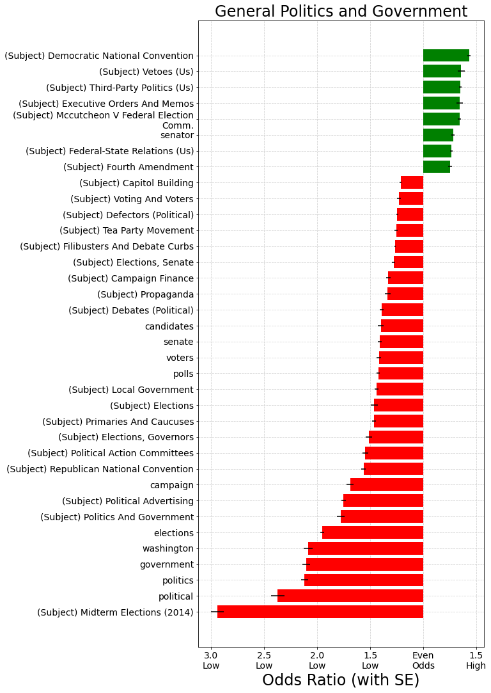
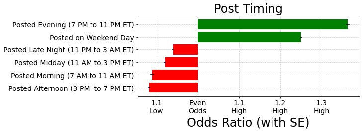

# How the New York Times can increase Facebook engagement

## Using machine learning to understand characteristics of high engagement
***
**Author**: Jessica Miles - jess.c.miles@gmail.com

***


This analysis uses machine learning to understand the characteristics of New York Times Facebook posts that predict higher engagement.

Although my model was not accurate enough to recommend using for prediction of future articles, it was able to determine important keyword and topical themes among high engagement posts. My interpretation of how similar topics and keywords might be grouped together is designed to help The New York Times prioritize the type of content to post to Facebook to increase engagement. 

## Business Problem

Modern Americans consume news in multiple formats: printed newspaper, online on websites, and on social media. To remain relevant in modern times, news outlets need to be able to engage users on platforms such as Facebook as well as using traditional methods. However, what Facebook users engage with more may differ from consumers of print media.

One criterion Facebook's News Feed algorithm uses to prioritize what its users see is amount of engagement (shares, comments, and likes) on a given post. Higher prioritization in News Feed may help content be disseminated to a wider audience, some of whom may decide to become subscribers.

Relevant and important news is not always the most popular, so outlets like The New York Times will likely not want to simply use top predictors of engagement on Facebook to decide what to report on. However, understanding what people engage with the most will shed light on what Facebook users care about, and may help The Times decide which articles to prioritize for posting. I also modeled how and when posts were made, to shed insights on steps The Times could take to increase engagement on any topic.

## Data
I started with a [found dataset](https://data.world/martinchek/2012-2016-facebook-posts) of about 48,000 Facebook posts from the New York Times' account covering the time period from late 2012 to late 2016. Data included the text in the post, when it was posted, and post type (link, video, or photo).

I also used the NYT API to pull all article metadata from this time period, and went through several steps to match the content in the Facebook posts to articles of mutimedia features. The NYT API provided additional metadata about the news content, such as topical subjects, article word count, and format (written versus multimedia).

Of the original 48,000, I was only able to match about 43,000 because of various differences between post text and links and the current text and links I could pull from the API. Therefore, I modeled all posts versus matched posts as two separate data sets.

## Methods

Engagement metrics included number of comments, shares, and likes/loves. Rather than focus on each of these separately, I created a single engagement metric.
- First, I calculated the percentile for each separate metric
- Then, I calculated the mean of percentiles across the three metrics to act as a single engagement metric
- For my binary classification problem, posts with mean percentile over 75th were considered "high engagement" and those under 75th were considered "low engagement".
- I also engineered a multi-class target using the same criteria for "high", but splitting the rest into "low" (below 25th percentile) and "moderate" (25th to 50th percentile).

Below are the distributions for each engagement metric. Note: Histograms don't include outliers for visibility, but percentiles are calculated with outliers included.

### Comments Distribution (All Posts)


### Shares Distribution (All Posts)


### Likes Distribution (All Posts)


The distributions of all Facebook posts and the smaller subset of posts matched to articles were quite similar. Although I modeled them separately, I used results from both sets of models in my final conclusions, without differentiating.

There appeared to be a slight uptick in engagement when posts were made on weekends, so I engineered a categorical variable for that.

I also engineered a categorical variable for time of day the post was made, as posts made in the morning and evening appeared to get more engagement.

When I visualized the most frequent words for high versus average engagement, I saw that words related to 2016 presidential candidates were more common in high engagement than in average. Otherwise though, they looked quite similar.

### Word Frequencies for Average Engagement


### Word Frequencies for High Engagement


I also noticed that some high engagement posts posed questions to users, and asked their opinions. I created custom stopwords lists without permutations of the word "you" and without the quotation mark, to test performance compared to full stop words and punctuation list.

## Model Performance

I modeled both a binary and multi-class problem. 

The binary performed slightly better on High Engagement, but the multi-class was interesting to understand how the model tended to get confused.

The best binary classification model was able to identify about 62% of high engagement posts correctly (score is cross-validated).

Preprocessing and model parameters were as follows:
- Removed NLTK stopwords and punctuation, with the exception of '?' and permutations of the word 'your'
- TF-IDF normalization on word vectors cosisting of  unigrams and bigrams
- No lemmatization (it was tried, and found not to improve model performance)
- Maximum 2000 features (both word vectors and categorical features)
- Logistic Regression model using L2 regularization, no intercept


Distributions of all three engagement metrics had lots of outliers on the high end and tapered off very smoothly. I chose the 75th percentile as the cutoff for high, but there really is no obvious cutoff point. I believe it's natural that the model would be confused about posts in the middle. The multi-class model confirms this, as it performed most poorly on the Moderate Engagement middle class.


## Recommendations:

To generate recommendations, I examined the predictors that had greatest odds ratios of High and Low engagement. Because the feature space was highly dimensional, and any given train-test-split may yield different top predictors, I performed 5 fits on different splits of the entire dataset, and generated a mean odds ratio across all 5 fits. I also calculated the confidence interval for this odds ratio based on the standard deviation across the fits. I ultimately only considered predictors which were included in at least 2 fits (only the top 2000 were used), and which had odds ratios over 1.0, outside the confidence interval. These confidence intervals are included as black lines on the plots below.

I reviewed the top predictors of high and low engagement manually, and grouped them logically into similar categories. I reviewed the top 300 predictors in each group.

### 1. Prioritize Breaking News over Recurring Content

- Breaking News was one of the top predictors of high engagement
- In contrast, posts that represented daily or recurring features tended to have lower engagement. Examples include: Quotation of the Day, New York Today, Daily Briefing ("Here's what you need to know to start your day"), What You Should Watch This Week 


### 2. Focus on the Current President and Election over General Politics

- Topics related to the candidates in the 2016 presidential election, and the current president and first lady at the time, were highly engaging.
- However, topics related to general politics and government were less engaging.




### 3. Prioritize U.S. National content over U.S. Local and Foreign

- Posts that mention 'America', 'Americans' and 'American', as well as patriotics themes such as the national anthem and flags, are highly engaging.
- Posts with words that seem more local to certain places are less engaging, as is most foreign coverage.


### 4. Post More Multimedia Content Outside Subscriber Paywall

- Video and Photo post types are where photos and videos were uploaded to Facebook, so are outside the paywall. These are more engaging.
- Most posts containing the words "video" or "watch" are actually posted as links to content, which is frequently behind the paywall. These are less engaging.


### 5. Post on Evenings and Weekends, when appropriate

- Content posted from 7 PM to 11 PM or on a weekend day has slightly increased odds of high engagement compared to posts added at other times
- This is likely due to News Feed algorithm prioritizing recently posted content, and these being popular times to engage with Facebook



### 6. Focus on Additional Highly Engaging Topics
- Opinion and Editorial content (though not Op-Eds and Ethics)
- Obituaries
- Recipes and Cooking (though not Food section)
- Parenting and Children
- Mental Health
- Beauty and Self Care
- Exercise
- Marriage and Relationships
- Religion

## Caveats and Limitations

- Facebook's own News Feed algorithm is very important to driving engagement, and is based partly on user-centric preferences which we can't model
- The cutoff point for "High engagement" is somewhat arbitrary
- Tastes change, so results from 2016 may not be applicable to present day. Facebook's algorithm also may have changed.
- These recommendations assume high engagement is the primary goal: they should be considered in the context of The Times' values and mission statement.

## Potential Next Steps

- Review sentiment of articles to see whether that affects engagement
- Compare engagement on Facebook to comments count on the New York Times website, so see if there is a difference in what drives engagement there
- Create an interactive dashboard so engagement of certain words and subjects can be reviewed

### For further information
Please review the narrative of my analysis in [my jupyter notebook](./index.ipynb) or review my [presentation](./presentaion.pdf)

For any additional questions, please contact **jess.c.miles@gmail.com


##### Repository Structure:

```

├── README.md                <- The top-level README for reviewers of this project.
├── data_gathering.ipynb     <- 1. Notebook used to gather data from NYT API and match it to posts
├── intro_eda.ipynb          <- 2. Project introduction and data cleaning and exploration
├── model_analysis.ipynb     <- 3. Modeling and analysis of model results to form recommendations
├── presentation.pdf         <- PDF version of project presentation
└── images
    └── images               <- images of visualizations
└── data
    └── data                 <- found and generated during analysis
└── models
    └── models               <- exported copies of best model pipelines, as well as notebook used to model in Google colab

```
